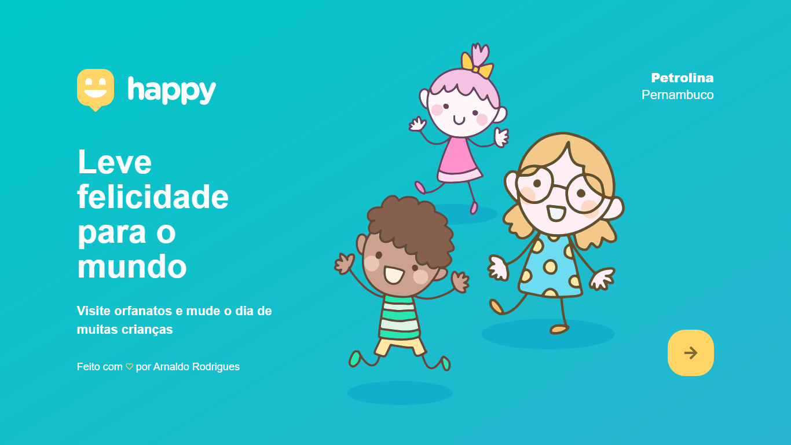
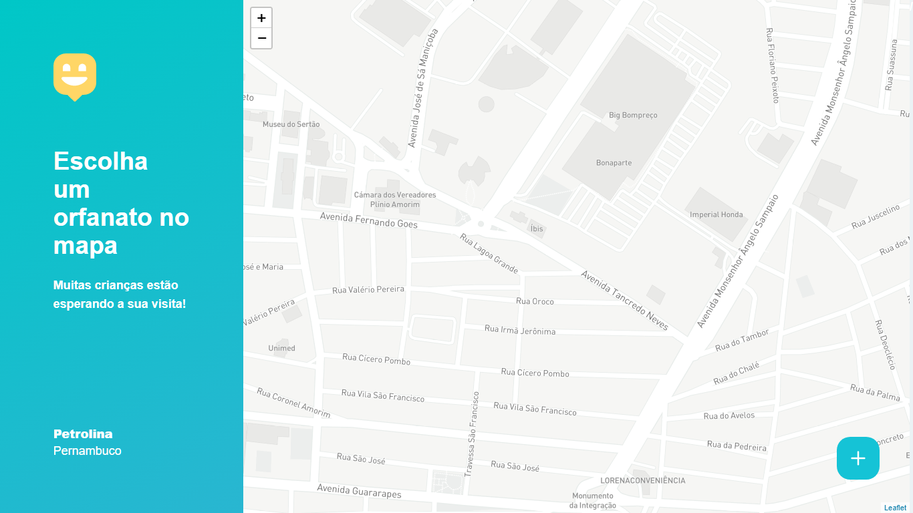

<h1 align="center">
  
</h1>

<h4 align="center">
  Aplicação web para encontrar orfanatos para visitação e fazer uma criança feliz :)
</h4>

<p align="center">


 
</p>

## Sobre
Projeto sendo realizado junto com a equipe da [Rocketseat](https://rocketseat.com.br/) pela terceira edição da Next Level Week. 🚀

## Tecnologias

Este projeto está sendo desenvolvido utilizando as seguintes tecnologias:

-  [ReactJs](https://pt-br.reactjs.org/)
-  [TypeScript](https://www.typescriptlang.org/)
-  [Node.js](https://nodejs.org/)

## Como executar

### Requerimentos
[Git](https://git-scm.com), [Node.js](https://nodejs.org/) v12.13.1 ou superior, [Npm](https://www.npmjs.com/).
<br>

### Aplicação
Para executar a aplicação, você deverá clonar este repositório e instalar as dependências.
```bash
# clone o repositório
git clone https://github.com/arxnaldo/happy-omnistack.git

# acesse a pasta
cd happy-omnistack-main/web

# instalando as dependências
npm install

# rodando a aplicação
npm start
```

### Screenshots
<h1 align="center">
  
  
</h1>

## Licença

Este projeto está sob a licença MIT.

## Contato

[Linkedin](https://www.linkedin.com/in/arxnaldo) <br>
[Instagram](https://instagram.com/arxnaldo)
